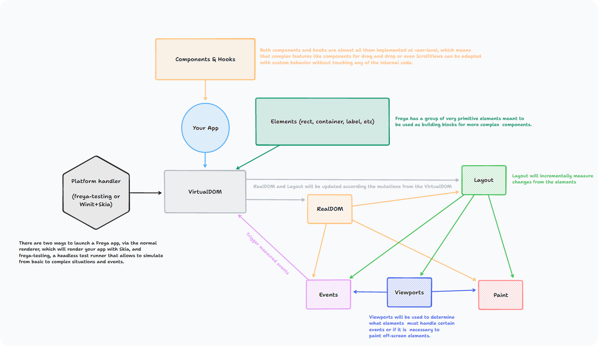
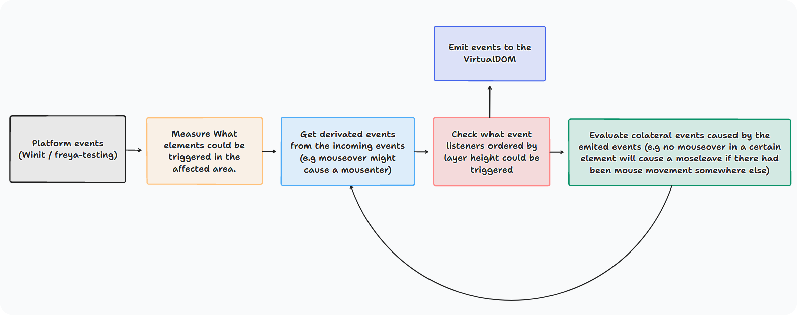

## Freya's internals

### Crates

| Name       | Description                                                                                |
|------------|--------------------------------------------------------------------------------------------|
| common     | Common data structures used in the other crates.                                           |
| core       | Viewport, event and layout APIs used by renderers.                                         |
| devtools   | The devtools sidepanel components and support.                                             |
| dom        | Freya's own DOM containing Dioxus RealDOM and layout.                                      |
| elements   | The elements, attributes and events namespace definition.                                  |
| freya      | Entry point to use Freya.                                                                  |
| components | Collection of basic components, like Button, ScrollView, etc.                              |
| hooks      | Collection of freya-only hooks provided to the user but also used by the components crate. |
| layout     | Integration with torin.                                                                    |
| renderer   | The graphical renderer that uses winit and skia.                                           |
| state      | The Dioxus Nodes internal states.                                                          |
| testing    | The headless renderer used for testing.                                                    |
| torin      | An agnostic UI layout library.                                                             |

Here is a high-level overview of the architecture:

### Events

WIP

