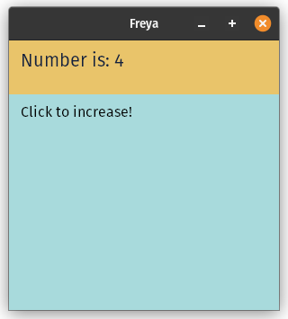

# Freya :crab:

<a href="https://freyaui.dev/"></a>

[](https://discord.gg/sYejxCdewG)
[](https://github.com/sponsors/marc2332)
[](https://codecov.io/github/marc2332/freya)

[Website](https://freyaui.dev) | [Docs](https://docs.freyaui.dev/freya) | [Book](https://book.freyaui.dev) | [Discord](https://discord.gg/sYejxCdewG)

**Freya** is a native GUI library for Rust powered by 🧬 [Dioxus](https://dioxuslabs.com) and 🎨 [Skia](https://skia.org/). 

⚠️ It's currently work in progress and not usable for production, but you can already play with it! You can join the [Discord](https://discord.gg/sYejxCdewG) server if you have any question or issue. 

<br/>
<br/>

<table>
<tr>
<td style="border:hidden;">

```rust
fn app(cx: Scope) -> Element {
    let mut count = use_state(cx, || 0);

    render!(
        container {
            height: "20%",
            width: "100%",
            background: "rgb(233, 196, 106)",
            padding: "12",
            color: "rgb(20, 33, 61)",
            label { 
                font_size: "20", 
                "Number is: {count}"
            }
        }
        container {
            height: "80%",
            width: "100%",
            background: "rgb(168, 218, 220)",
            color: "black",
            padding: "12",
            onclick: move |_| count += 1,
            label { "Click to increase!" }
        }
    )
}
```
</td>
<td style="border:hidden;">



</td>
</table>

### Want to try it? 🤔

⚠️ First, see [Environment setup](https://book.freyaui.dev/setup.html).

Clone this repo and run:

```shell
cargo run --example counter
```

You can also try [`freya-template`](https://github.com/marc2332/freya-template)

### Usage 📜
Add Freya as a dependency via git (it's not published on [crates.io](https://crates.io/) yet) in your `Cargo.toml`:

```toml
freya = { git = "https://github.com/marc2332/freya" }
dioxus = { git = "https://github.com/DioxusLabs/dioxus", rev="c9044111908338c347b2b00bb48f579e5d9e1877", features = ["macro", "hooks"]}
```

### Features ✨
- Support for Windows, Linux and MacOS
- Text, containers, images, svg, etc
- Headless testing
- Hot reload
- Optional DevTools panel
- Easy multiline text editing
- Components crate (with theming support)
   - Scroll views 
   - Virtualized scroll views
   - Button
   - Slider
   - Switch
   - Dropdown
   - and a few more
- Keyboard and Mouse events
- Hooks crate for text editing, animating, theming..

### Goals 😁
- Performant
- Low memory usage
- Lightweight 
- Good developer experience
- Cross platform

## Status ⌚

You can see the tracking [issues](https://github.com/marc2332/freya/issues?q=is%3Aopen+is%3Aissue+label%3Atracking) labeled with the `tracking` label to know what features are implemented and which ones are not, yet.

[MIT License](./LICENSE.md)
