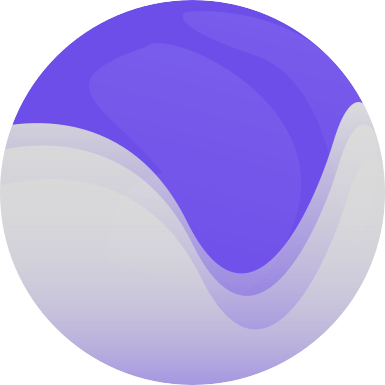

# Freya 🦀

<a href="https://freyaui.dev/"></a>

[](https://discord.gg/sYejxCdewG)
[](https://github.com/sponsors/marc2332)
[](https://codecov.io/github/marc2332/freya)

[Website](https://freyaui.dev) | [Nightly Docs](https://docs.freyaui.dev/freya) | [Stable Docs](https://docs.rs/freya/latest/freya) | [Book](https://book.freyaui.dev) | [Discord](https://discord.gg/sYejxCdewG)

**Freya** is a native GUI library for Rust powered by 🧬 [Dioxus](https://dioxuslabs.com) and 🎨 [Skia](https://skia.org/). 

⚠️ It's currently work in progress and not usable for production, but you can already play with it! You can join the [Discord](https://discord.gg/sYejxCdewG) server if you have any question or issue. 

<br/>
<br/>

<table>
<tr>
<td style="border:hidden;">

```rust, no_run
fn app() -> Element {
    let mut count = use_signal(|| 0);

    rsx!(
        rect {
            height: "20%",
            width: "100%",
            background: "rgb(233, 196, 106)",
            padding: "12",
            color: "rgb(20, 33, 61)",
            label { 
                font_size: "20", 
                "Number is: {count}"
            }
        }
        rect {
            height: "80%",
            width: "100%",
            background: "rgb(168, 218, 220)",
            color: "black",
            padding: "12",
            onclick: move |_| count += 1,
            label { "Click to increase!" }
        }
    )
}
```
</td>
<td style="border:hidden;">


</td>
</table>

### Sponsors 🤗

Thanks to my sponsors for supporting this project! 😄

<!-- sponsors --><a href="https://github.com/piny4man"></a><a href="https://github.com/andar1an"></a><!-- sponsors -->

### Want to try it? 🤔

⚠️ First, see [Environment setup](https://book.freyaui.dev/setup.html).

Clone this repo and run:

```shell
cargo run --example counter
```

You can also try [`freya-template`](https://github.com/marc2332/freya-template)

### Usage 📜
Add Freya and Dioxus as dependencies:

```toml
freya = "0.2"
dioxus = { version = "0.4", features = ["macro", "hooks"], default-features = false }
```

### Features ✨
- ⛏️ Built-in **components** (button, scroll views, switch and more) 
- 🚇 Built-in **hooks** library (animations, text editing and more)
- 🔍 Built-in **devtools** panel (experimental ⚠️)
- 🧰 Built-in **headless testing** runner for components
- 🎨 **Theming** support (not extensible yet ⚠️)
- 🛩️ Cross-platform (Windows, Linux, MacOS)
- 🖼️ SKSL **Shaders** support
- 🔄️ Dioxus **Hot-reload** support
- 📒 Multi-line **text editing** (experimental ⚠️)
- 🦾 Basic **Accessibility** Support (experimental ⚠️)
- 🧩Compatible with dioxus-sdk and other Dioxus renderer-agnostic libraries

### Goals 😁
- Performant and low memory usage
- Good developer experience
- Cross-platform support
- Decent Accessibility support 
- Useful testing APIs
- Useful and extensible components and hooks

## Status ⌚

You can see the tracking [issue](https://github.com/marc2332/freya/issues/200) to know what features are implemented and which ones are not, yet.

[MIT License](./LICENSE.md)
