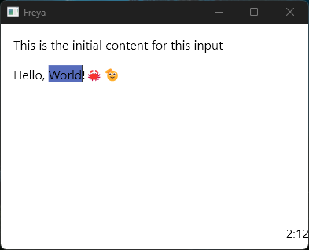

# Building a Text Input

This is a small guide on how to build a small text input component from scratch using the Freya hook [use_editable](https://docs.rs/freya-hooks/0.2.1/freya_hooks/fn.use_editable.html).



```rs
fn main() {
    launch(app);
}

fn app() -> Element {
    // `use_editable` is a Freya hook to create editable text content, 
    // internally uses a Rope, has a changes history and integrates 
    // with the mouse and keyboard events.
    // It even supports virtualization of lines if desired.
    let mut editable = use_editable(
        || { 
            EditableConfig::new("This is the initial content for this input".to_string())
        },
        // We are not virtualizing the lines so we are just gonna use this moed
        EditableMode::MultipleLinesSingleEditor,
    );

    let editor = editable.editor().read();

    // Cursor reference that needs to be passed to the `paragraph`
    // So freya can properly map clicks and dragging
    let cursor_reference = editable.cursor_attr();
    // Get the highlights available for this editor
    // Because we are using `EditableMode::MultipleLinesSingleEditor` we assume the editor id is 0
    let highlights = editable.highlights_attr(0);
    // Get the cursor position index
    let cursor_pos = editor.cursor_pos();
    // Get the cursor position as row and col
    let (cursor_row, cursor_col) = editor.cursor_row_and_col();

    // Map the events to the hook by calling `process_event`
    // It is important that the events are registered in the `paragraph` element
    let onmousedown = move |e: MouseEvent| {
        editable.process_event(&EditableEvent::MouseDown(e.data, 0));
    };

    let onmousemove = move |e: MouseEvent| {
        editable.process_event(&EditableEvent::MouseMove(e.data, 0));
    };

    let onclick = move |_: MouseEvent| {
        editable.process_event(&EditableEvent::Click);
    };

    let onglobalkeydown = move |e: KeyboardEvent| {
        editable.process_event(&EditableEvent::KeyDown(e.data));
    };

    let onglobalkeyup = move |e: KeyboardEvent| {
        editable.process_event(&EditableEvent::KeyUp(e.data));
    };

    rsx!(
        rect {
            width: "100%",
            height: "100%",
            cursor_reference,
            ScrollView {
                width: "100%",
                height: "calc(100% - 30)",
                padding: "16",
                scroll_with_arrows: false,
                paragraph {
                    width: "100%",
                    cursor_id: "0",
                    cursor_index: "{cursor_pos}",
                    cursor_mode: "editable",
                    cursor_color: "black",
                    highlights,
                    onclick,
                    onmousemove,
                    onmousedown,
                    onglobalkeydown,
                    onglobalkeyup,
                    text {
                        "{editable.editor()}"
                    }
                }
            }
            label {
                width: "fill",
                height: "30",
                text_align: "end",
                "{cursor_row}:{cursor_col}"
            }
        }
    )
}
```