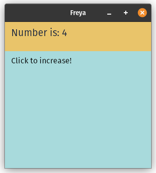

> 👋 Note: This Book is being constantly updated, so, there might some features that have been added, removed or changed.

> ⚠️ Warning: This Book might contain APIs from the latest git version that might not be available on the stable versions released on crates.io.

# Welcome

**Freya** is a **work in progress** cross-platform native GUI library for 🦀 Rust, built on top of 🧬 [Dioxus](https://dioxuslabs.com) and 🎨 [Skia](https://skia.org/) as graphics library. 

- [What is Freya?](./what_is_freya.html)
- [Main differences with Dioxus](./differences_with_dioxus.html)
- [Environment Setup](./setup.html)
- [API References](https://docs.rs/freya/latest/freya/)
- [Discord](https://discord.gg/sYejxCdewG)

<table>
<tr>
<td style="border:hidden;">

```rust, no_run
fn app(cx: Scope) -> Element {
    let mut count = use_state(cx, || 0);

    render!(
        rect {
            height: "20%",
            width: "100%",
            background: "rgb(233, 196, 106)",
            padding: "12",
            color: "rgb(20, 33, 61)",
            label { 
                font_size: "20", 
                "Number is: {count}"
            }
        }
        rect {
            height: "80%",
            width: "100%",
            background: "rgb(168, 218, 220)",
            color: "black",
            padding: "12",
            onclick: move |_| count += 1,
            label { "Click to increase!" }
        }
    )
}
```
</td>
<td style="border:hidden;">



</td>
</table>

Check out the examples in the Freya [repository](https://github.com/marc2332/freya/tree/main/examples) to learn more.
