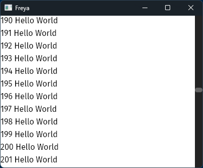

# Virtualizing

Virtualizing helps you render a lot of data efficiently. It will only mount the elements you see in the screen, no matter how big the data is.

### Target usages
- Text editor
- Tables
- Etc

### Usage

Freya comes with a `VirtualScrollView` component which can help you archive the virtualization of some data.

> The virtualization logic of `VirtualScrollView` is implemented at component-level, so, you could implement your own version if you wanted.

Here is an example:
```rust
fn main() {
    launch(app);
}

fn app(cx: Scope) -> Element {
    let values = use_state(cx, || vec!["Hello World"].repeat(400));

    render!(
        VirtualScrollView {
            width: "100%",
            height: "100%",
            show_scrollbar: true,
            direction: "vertical",
            length: values.get().len(),
            item_size: 25.0,
            builder_values: values.get(),
            builder: Box::new(move |(key, index, values)| {
                let values = values.unwrap();
                let value = values[index];
                rsx! {
                    label {
                        key: "{key}",
                        height: "25",
                        "{index} {value}"
                    }
                }
            })
        }
    )
}
```

<table>
<td style="border:hidden;">



</td>
</table>

### Parameters
#### `show_scrollbar`
By default, it does not display a scrollbar. However, you can enable it by setting the `show_scrollbar` parameter to true.

#### `direction`
It supports both `vertical` and `horizontal` directions. If direction is set to `vertical`, the items will be displayed in a single column, with the scrollbar appearing on the right-hand side. If direction is set to `horizontal`, the items will be displayed in a single row, with the scrollbar appearing at the bottom.

#### `length`
How many elements can be rendered. Usually the lenth of your data.

####  `item_size`
Used to calculate how many elements can be fit in the viewport. 

#### `builder_values`
Any data that you might need in the `builder` function

#### `builder`
This is a function that dinamically creates an element for the given index in the list. It receives 3 arguments, a `key` for the element, the `index` of the element and the `builder_values`.