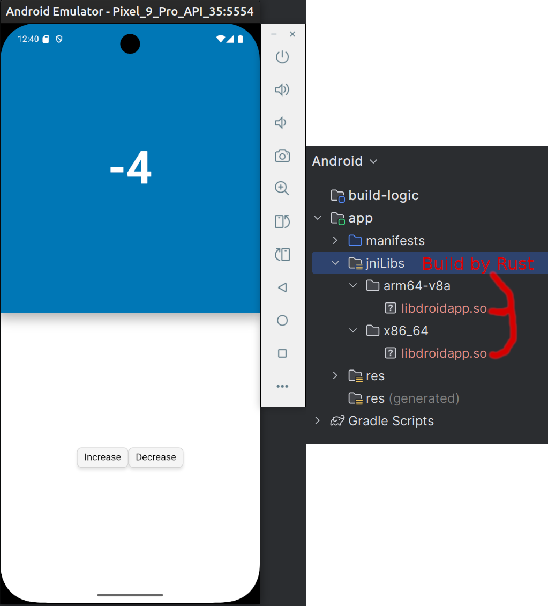

## WARNING: This is experimental

### Install cargo ndk:
[https://lib.rs/crates/cargo-ndk](https://lib.rs/crates/cargo-ndk)
```
cargo install cargo-ndk
```
### Install Android Studio:
[Android Studio](https://developer.android.com/studio)

### Download NDK:
- Linux: https://dl.google.com/android/repository/android-ndk-r28-linux.zip
- MacOS: https://dl.google.com/android/repository/android-ndk-r28-darwin.dmg
- Windows: https://dl.google.com/android/repository/android-ndk-r28-windows.zip

**On Linux** you may run into trouble when **OpenSSL libraries** are missing. On **Debian** and **Ubuntu** they can be installed with:
```
sudo apt-get install pkg-config libssl-dev
```

### Install abis (armv7-linux-androideabi and i686-linux-android are 32bits only for old devices)
```
rustup target add aarch64-linux-android x86_64-linux-android
```

### Add NDK to Environment variables:
```
export ANDROID_NDK_HOME="<PATH_TO_UNPACKED_NDK>/android-ndk-r28"
export ANDROID_NDK="<PATH_TO_UNPACKED_NDK>/android-ndk-r28"
```

### Build abis (add -t armv7-linux-androideabi for old devices)
```
cd examples/android
cargo ndk -o app/src/main/jniLibs/ -t arm64-v8a -t x86_64-linux-android build --release
```

### Run the App on Desktop
`cargo run --features="desktop"`

### Run the App on Android (Emulator/Device)
Open `Android Studio` and open the `android` folder as a Project. Run the App on Emulator or Devices.



------

## Troubleshoot
Ninja is missing:
```failed to run `ninja`, does it exist in PATH?: Os { code: 2, kind: NotFound, message: "No such file or directory" }
  note: run with `RUST_BACKTRACE=1` environment variable to display a backtrace```

Install Ninja on Ubuntu:
`sudo apt-get install ninja-build`

Download and install: [https://github.com/ninja-build/ninja/releases](https://github.com/ninja-build/ninja/releases)

------
If you see this error your linker is not in your `$PATH`:
**Error:**
```
End of search list 
./src/bindings.cpp:1:10: fatal error: 'cassert' file not found
```
------
Try this:
```
export PATH="$NDK_HOME/toolchains/llvm/prebuilt/<YOUR_SYSTEM_AND_ARCH>/bin:$PATH"
```
Also see `skia-safe` for more compiler issues:
[https://github.com/rust-skia/rust-skia](https://github.com/rust-skia/rust-skia)